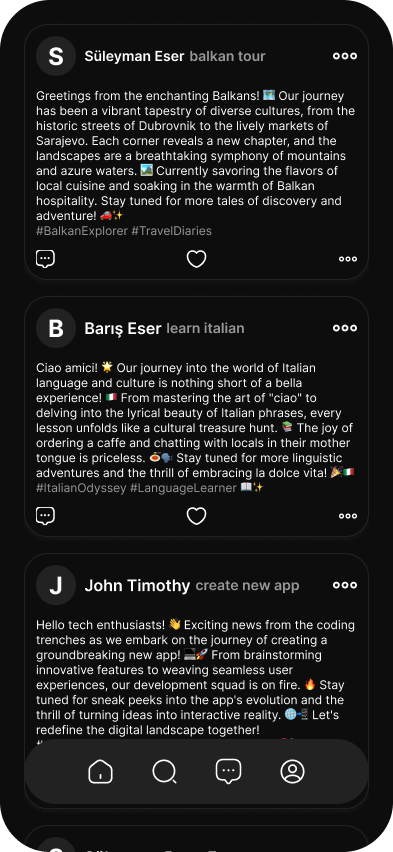

# Social Goal

Social goal is a social platform where people, companies, communities and etc. share their goals for future and the processes of the goal.



## Table of Contents

- [Installation](#installation)
- [Usage](#usage)
- [License](#license)

## Installation

To get started with this project, follow these steps:

1. Make sure you have [yarn](https://yarnpkg.com/) installed globally. If not, you can install it by running:

   ```shell
   $ npm install -g yarn
   ```

2. Clone the repository:

   ```shell
   $ git clone https://github.com/suleymanbariseser/social-goal.git
   $ cd social-goal
   ```

3. Install the dependencies using yarn:
   ```shell
   $ yarn install
   ```

This will install all the required dependencies for all the projects within the workspace.

## Usage

To run the project, follow these steps:

1. You can start the client project by running the following command:

   ```shell
   $ yarn client start
   ```

2. Similarly, you can start the server project by running the following command:

   ```shell
   $ yarn server dev
   ```

Make sure you navigate to the appropriate project directory before running the corresponding command.

## License

This project is licensed under the terms of the [MIT license](/LICENSE).
